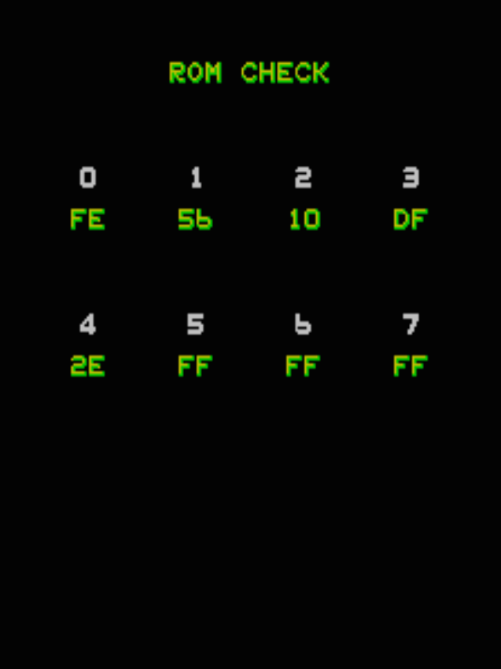

# Blue Print freeplay with attract mode v1

## Installation

Burn the ROM images bp-1.1m and bp-5.1s to two 2732A EPROMs, and
install them at 1M and 5S on the main game PCB. Ensure that the free
play DIP is set to the correct position. That’s it.

Note that your game PCB may be configured to use 2532 EPROMs, rather
than 2732A. If this is the case, you will need to use 2532s, OR burn
an entire ROM set and configure your PCB appropriately. See the note
in the schematics, on page 9-9 of
[the manual](http://arcarc.xmission.com/PDF_Arcade_Bally_Midway/Blueprint_Parts_and_Operating_Manual_%20(Sep_1982).pdf).

## Service mode

When in service mode, the ROM check screen will appear as follows:

## Theory

When set pay-to-play, the game’s main loop calls $1593 to scan for
coins being input, which increments the credit count at $8094. A
different routine checks this location to see whether the game may be
started, and calls the game start splash screen, at $262D.

The patch is placed at $4D60, which is unused ROM space. The call to
$1593 (at $094C) is patched to call $4D60 instead of the coin input
routine.

During game startup, the DIP switch values are read and stored into
RAM at $809E. The patch checks the value of the DIPs at this location
to see if free play is enabled. If not, the normal coin input routine
is called, which preserves the pay-to-play settings.

If the free play DIP is enabled, the P1 and P2 start buttons are
scanned to see if one of them is being pressed. If so, the game start
code at $262D is called; otherwise it returns.

The game normally checks for the free play DIP at $0660, and jumps to
$262D if it’s set. This check gets NOPped out to make the attract mode
run.

## Source

[The source code is freely available](patch.s).

## Copyright

To the extent that this patch represents original work, I place it in
the public domain.
